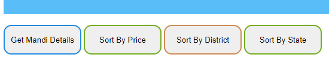
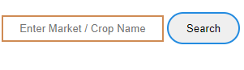
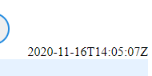

# Mandi Market Application

_Access Current Daily Price of Various Commodities from various Markets._ 
Application pull data dynamically from the government portal via API in the form of JSON format which is processed with AJAX using XMLHttpObject. Various features like getting thorough detail of different Markets, Crops, Prices (current, min, max) , Sorting the Details by Crop name, State name, Price of the Commodities.  There is Search Box to fetch specific Market details or via Crop Name. 
**NOTE - _By default only top 10 items can be pulled from the API which is available for the public use._ Follow the below links for more details.** 

## **Features**

- Get Complete Details of the Commodities.

- Sort the details by Price, Crops / State / Market name.
- 
- Application fetches the data dynamically and periodically check for the updated price of the crops.

- Find out the difference between the maximum and the minimum price of the crops.

- Try out the search out by typing Crop / Market name
- 

- Display the time and date of last update / keeps automatically synchronized.
- 

- ~~_ Still counting..._~~

## **Links**
- [API source link](https://data.gov.in/resources/current-daily-price-various-commodities-various-markets-mandi/api "fetch govt. backed api")

- [Explore other Projects](https://github.com/singhdks23/Get_Set_G0 "try this out")

## **Usages**
>Explore the Application and point out your suggestions and feedback.
Go ahead and give a try. 

